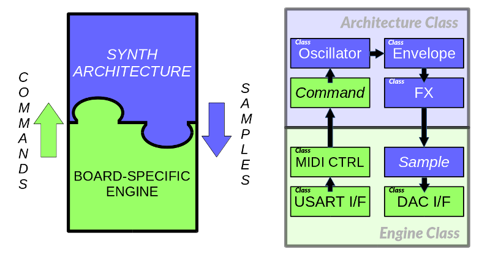
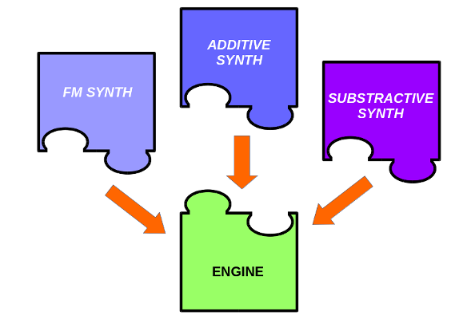
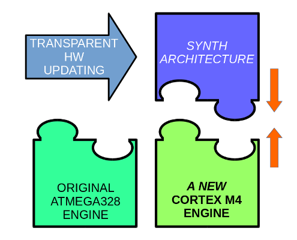
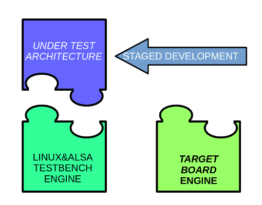

# flexYnth
## A flexible synthesizer development library.

**flexYnth** is a **C++** library aimed for multi-plattform synthesizer software development.  

The library is divided into two set of base classes called **Engine Scheme** and **Synthesizer Scheme** that once implemented yield a
**Synthesizer Engine** and a **Synthesis Architecture** respectively.

 **Example of a Synthesizer and Engine class scheme and some of its members and interaction.** 

## Scope
This project is specially developed to ease and somewhat standardize the development of DIY synthesizer boxes based on DSP or
microcontrollers. The idea came while researching onto some nice electronic synthesizer projects out there in the net.  
I realized that could be really benefical if there'd be a way to solve the hardware and software implementation separately.

*A PC/Linux Synthesizer Engine is also offered for Synthesis Architecture testing.*

### Usage Examples

- Provided we have a completed **Synthesizer Engine** developed and tested for a specific HW/OS plattform
(i.e.: Arduino box, Custom PCB, PC running Linux) we can implement any existing **Synthesis Architecture** on it.

 **Different Synthesis Architectures can connect to an unique Engine at compile time.** 

- You may want to expand/simplify an existing Synthesizer Project capabilities, updating the controls, the motherboard, the DAC,
the CPU. In this case you should want to code a new **Synthesizer Engine** following the **Engine Scheme** provided with **flexYnth**.

 **HW can be upgraded just by developing a new Engine. (i.e. for polyphony expansion, a new PCB, more inputs, ...)** 

- It's easy to develop a **Synthesis Architecture** with the **Synthesizer Scheme** provided with **flexYnth**.
You can take advantage of the existing **Linux Engine** for testing purposes.

 **ALSA/Linux Engine allows for out-of-board Architecture debugging.** 

