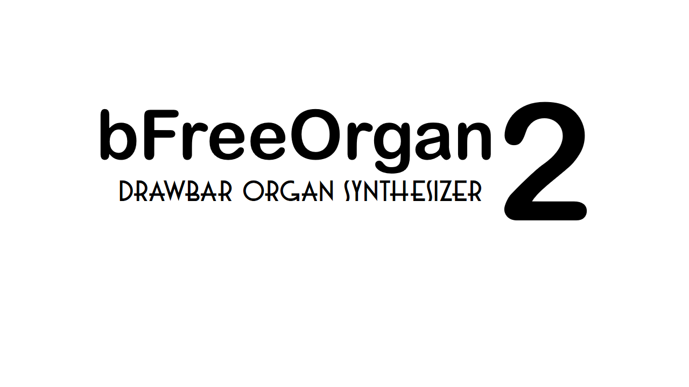
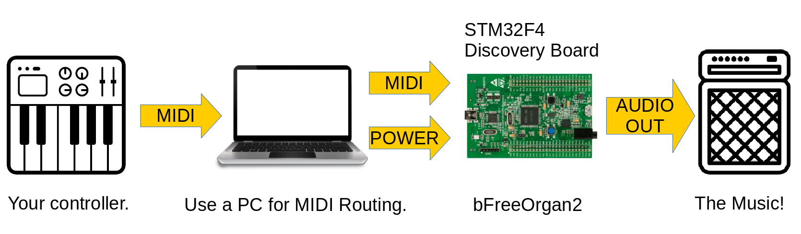

# bfreeOrgan2
## A flexYnth-based Tonewheel Organ Synthesizer
### By Franco Caspe (francocaspe@hotmail.com)

**bfreeOrgan2** is a C++ coded, synchronous tonewheel organ synthesizer for the STM32F4 Discovery board and Linux, based on the [flexYnth](https://github.com/fcaspe/flexynth) development library.

## Presentation

## Introduction
I love the Hammond Organ! but as June 2019 there was no open-source homebrew box that implements a nice Drawbar Organ, so I decided to code one myself.

In the efforts of doing so, I learned a lot of efficient programming on C++ so I opted to create a base library to modularize the code, and to allow me to easily 
expand this project in the future, or to develop new synths! Thus creating **flexYnth** and **bfreeOrgan2**.

## Scope
This project implements a modularly-coded tonewheel drawbar organ synthesizer, implemented on two different **flexYnth Engines**, each one in different branches.
1. A Linux/ALSA testbench implementation.
2. A STM32F4 Discovery Board Implementation.

## Features

 * 10 voice Polyphony.
 * Real time 9 Drawbar control.
 * Chorus effect with adjustable Rate and Amplitude.
 * Envelope and Optional Click Generator.
 * Commands are controled over MIDI CC's. (See the MIDI mapping in utils/vmpk.ins)
 * 16bit@48Khz Mono output.

# Build it!

## For the Discovery STM32F407

*FIRST switch to the Discovery STM32F407 Board branch.* 

1. Run: 'git checkout discovery_f4'

NOTE: Make sure the arm-gcc toolset path is set in the PATH enviroment variable when you run make.  
[Get ARM GCC Toolset](https://developer.arm.com/open-source/gnu-toolchain/gnu-rm/downloads)

For Flashing the discovery, the makefile uses texane/stlink toolThe latest version that is currently working fine for the STM32F4 Discovery board is 1.3.0.
[Get Texane's stlink utility](https://github.com/texane/stlink)

2. Run: 'make'
3. Connect the STM32F4 Discovery Board to the PC.
4. Run: 'make flash'

After the Discovery Board is flashed, connect the User USB Port to your computer. It will recognize a MIDI Device.
Route a controller to the MIDI input of the Board. The audio output is provided by the 3.5mm Jack of the Discovery Board.

## On Linux/ALSA:

NOTE: Make sure you have the Alsa Development Libs installed.

*FIRST switch to the linux_alsa branch:* 

1. Run: 'git checkout linux_alsa'
2. Run 'make'
3. Execute the testbench: './bin/testbench'

An ALSA MIDI port will open for you to connect your favorite controller! ( I use alsaconnectgui )

## License

Released under Apache V2.0 License.